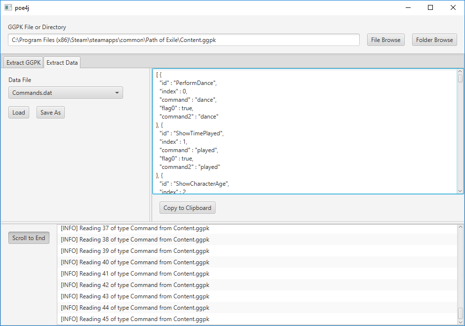

# poe4j [](https://travis-ci.org/jacob-swanson/poe4j)

poe4j is a [Path of Exile](https://www.pathofexile.com/) datamining library written in Java (hence the 4j part of the name).



## Overview

With poe4j you can:

* Extract files from Content.ggpk
* Parse Data/*.dat files from Content.ggpk with or without extracting 

Currently you can use poe4j to extract Content.ggpk and the data from data files, usable through poe4j-gui.

Loading data files works similarly to how JPA works. If you've used any frameworks like Hibernate, it should look familiar. Everything maps to a nice strongly typed Java class. You wont have to mess with maps or dictionaries of data. The GUI displays the data files as JSON using [Jackson](https://github.com/FasterXML/jackson) and takes advantage of its identity feature to prevent loops between data. However, some of files still have a large amount of data that they reference. For instance, WorldAreas extracts to around 60 MB of JSON text.

References in the data files are lazily loaded, so if you're developing with poe4j, you wont have to load references yourself nor will you have to load referenced data that you don't need.

The first, and only tool at the moment written with poe4j is a [Chromatic Calculator](https://jacob-swanson.github.io/poe4j/#/chromatic-calculator) that has all of the base items and their attribute requirements loaded. A random base item is chosen upon loading the page.

A big thanks goes to the [PyPoE](https://github.com/OmegaK2/PyPoE) project for providing the data definitions that were parsed and turned into Java code.

## Maven Artifacts
Add the folling to your pom.xml file to use the artifacts hosted on github.
```
<repositories>
  <repository>
    <id>poe4j-mvn-repo</id>
    <url>https://raw.github.com/jacob-swanson/poe4j/mvn-repo/</url>
    <snapshots>
      <enabled>true</enabled>
      <updatePolicy>always</updatePolicy>
    </snapshots>
  </repository>
</repositories>

...

<dependencies>
  <dependency>
    <groupId>com.swandiggy</groupId>
    <artifactId>poe4j</artifactId>
    <version>1.0-SNAPSHOT</version>
  </dependency>
</dependencies>
```
